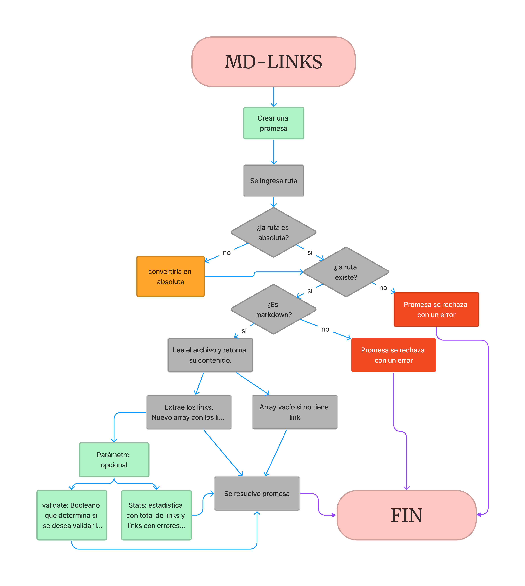

# Markdown Links

---

## Descripción

Md-Links es una librería en Node.js diseñada para analizar enlaces dentro de archivos [Markdown], ya sea proporcionandonos la validación de los enlaces, el estado de estos enlaces y la estadistica para mejor analisis.

### Instalación

Como primer requisito debes tener instalado [Node.js](https://nodejs.org/en).
Para instalar la librería `md-links` utilizando NPM (Node Package Manager):

1. Ejecuta el siguiente comando en tu terminal:

`npm i md-links-catin`

2. Uso:

* Para leer un archivo markdown y extraer sus enlaces escribe md-links seguido de la ruta del archivo.

```shell
`mdLinks <path-to-file> [options]`
```

Por ejemplo:


El comportamiento por defecto no debe validar si las URLs responden ok o no,
solo debe identificar el archivo Markdown (a partir de la ruta que recibe como
argumento), analizar el archivo Markdown e imprimir los links que vaya
encontrando, junto con la ruta del archivo donde aparece y el texto que hay
dentro del link.

## Options

### `--validate`

Si pasamos la opción `--validate`, el módulo debe hacer una petición HTTP para
averiguar si el link funciona o no. Si el link resulta en una redirección a una
URL que responde ok, entonces consideraremos el link como ok.

Por ejemplo:


Vemos que el _output_ en este caso incluye la palabra `ok` o `fail` después de
la URL, así como el status de la respuesta recibida a la petición HTTP a dicha
URL.

### `--stats`

Si pasamos la opción `--stats` el output (salida) será un texto con estadísticas
básicas sobre los links.


También podemos combinar `--validate` y `--stats` para obtener estadísticas que
necesiten de los resultados de la validación.


### Diagrama de Flujo

Acontinuación, verás un diagrama de flujo, para entender el proceso de `md-links`.


- 